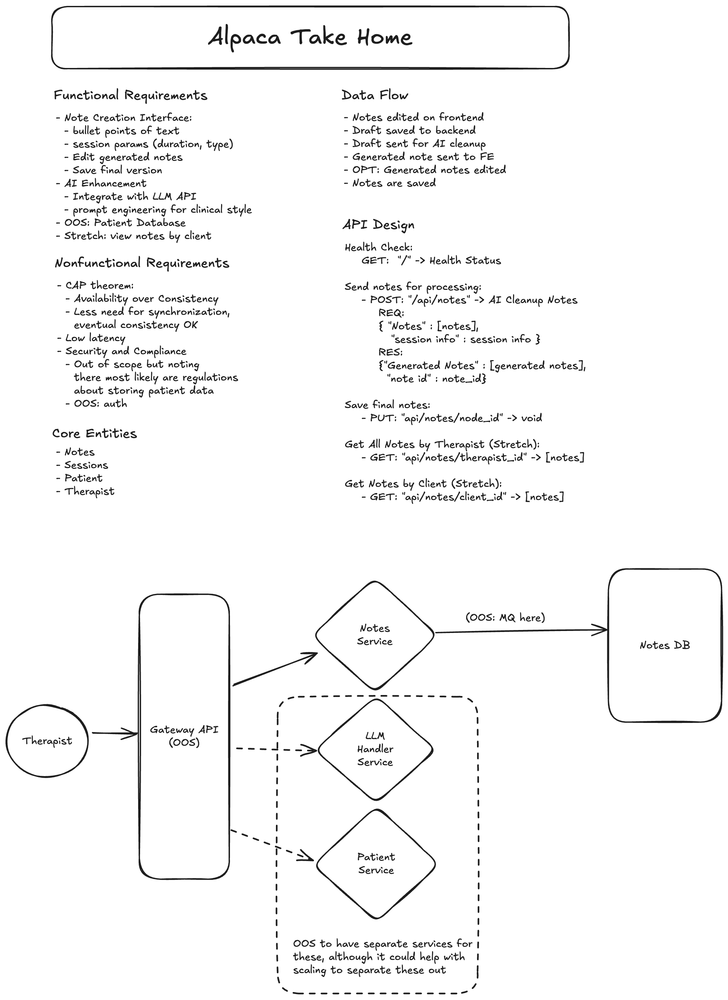

# Alpaca Health Software Engineering Take-Home Project

### Project Description

Visit this link for details:
[https://harviio.notion.site/Alpaca-Health-Eng-Take-home-Project-1411bfc50b90803382d4cae01f9bcf18?pvs=4](https://www.notion.so/harviio/ABA-Session-Note-Generator-Take-Home-Project-1411bfc50b90803382d4cae01f9bcf18?pvs=4)

## Setup Instructions

### Backend Setup (Python 3.11+ required)

```bash
# Create and activate virtual environment
python -m venv alpaca_venv
source alpaca_venv/bin/activate  # or `venv\Scripts\activate` on Windows

# Install dependencies
pip install -r requirements.txt

# Start the server
fastapi dev main.py
```

### Frontend Setup (Node.js 18+ required)

```bash
# Navigate to frontend directory
cd frontend

# Install dependencies
npm install

# Start the development server
npm run dev
```

The application will be available at:

- Frontend: http://localhost:3000
- Backend API: http://localhost:8000
- API Documentation: http://localhost:8000/docs

## Default Project Structure

- `frontend/`: Next.js application
  - `src/components/`: Reusable React components
  - `src/app/`: Next.js app router pages
- `backend/`: FastAPI application
  - `app/main.py`: API endpoints

## Development

- Frontend runs on port 3000 with hot reload enabled
- Backend runs on port 8000 with auto-reload enabled
- API documentation available at http://localhost:8000/docs

## Design considerations

Here is an early sketch of the system design.


I delineated as Out of Scope (OOS) for this project a few essential features for production readiness (user auth, security and compliance).

## Production Readiness Checklist

### 🔒 Security

- [ ] Environment-based configuration
- [ ] Input validation on front end
- [ ] Database connection security
- [ ] Implement rate limiting
- [ ] Add HTTPS support
- [ ] Add security headers
- [ ] Add CSRF protection

### 🚀 Performance

- [ ] Configure notes_db for async operations
- [ ] Add Message Queue to DB Operations

### 📊 Reliability

- [ ] Comprehensive error handling
- [ ] OpenAPI spec
- [ ] Containerized with Docker
- [ ] Graceful error pages for front end
- [ ] Add database failover strategy
- [x] Health check endpoint

### 🧪 Testing

- [ ] Unit tests for routing and logic
- [ ] Database Tests
- [ ] Error scenario testing
- [ ] Performance/load testing
- [ ] End-to-end testing
- [ ] Contract testing

### 📝 Documentation

- [ ] OpenAPI specification
- [ ] Docker Setup Instructions

### 🔍 Observability

- [ ] Basic logging
- [ ] Add request tracing
- [ ] Configure application monitoring

### ⚙️ Configuration

- [ ] Environment-based port configuration
- [ ] Logging configuration
